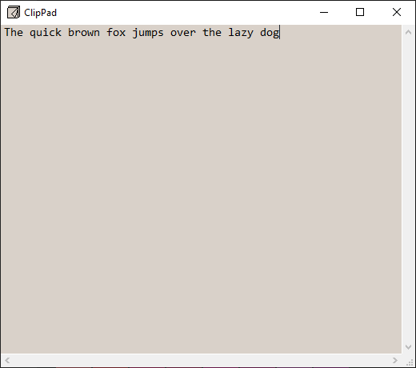

# ClipPad

A barebones plaintext scratch pad.

## Usage

> - <kbd>Ctrl</kbd>+<kbd>N</kbd> to open new note.
> - <kbd>Ctrl</kbd>+<kbd>W</kbd> to close note.
> - <kbd>Ctrl</kbd>+<kbd>L</kbd> to lock/unlock note.

> - <kbd>Ctrl</kbd>+<kbd>S</kbd> to save current note as file.
> - <kbd>Ctrl</kbd>+<kbd>O</kbd> to load file into current note.
> - <kbd>Ctrl</kbd>+<kbd>R</kbd> to reload the last loaded file.

> - <kbd>F11</kbd> to toggle fullscreen.
> - <kbd>Ctrl</kbd>+<kbd>Wheel</kbd>/<kbd>+</kbd>/<kbd>-</kbd>/<kbd>0</kbd> to zoom/reset.

> - <kbd>Ctrl</kbd>+<kbd>T</kbd> to change font.
> - <kbd>Ctrl</kbd><kbd>Shift</kbd>+<kbd>T</kbd> to change text color.
> - <kbd>Ctrl</kbd>+<kbd>K</kbd> to change background color.

Only UTF-8 encoding is currently supported.

To open multiple files, drag-and-drop them onto the exe or shortcut, or pass their paths as launch arguments.
